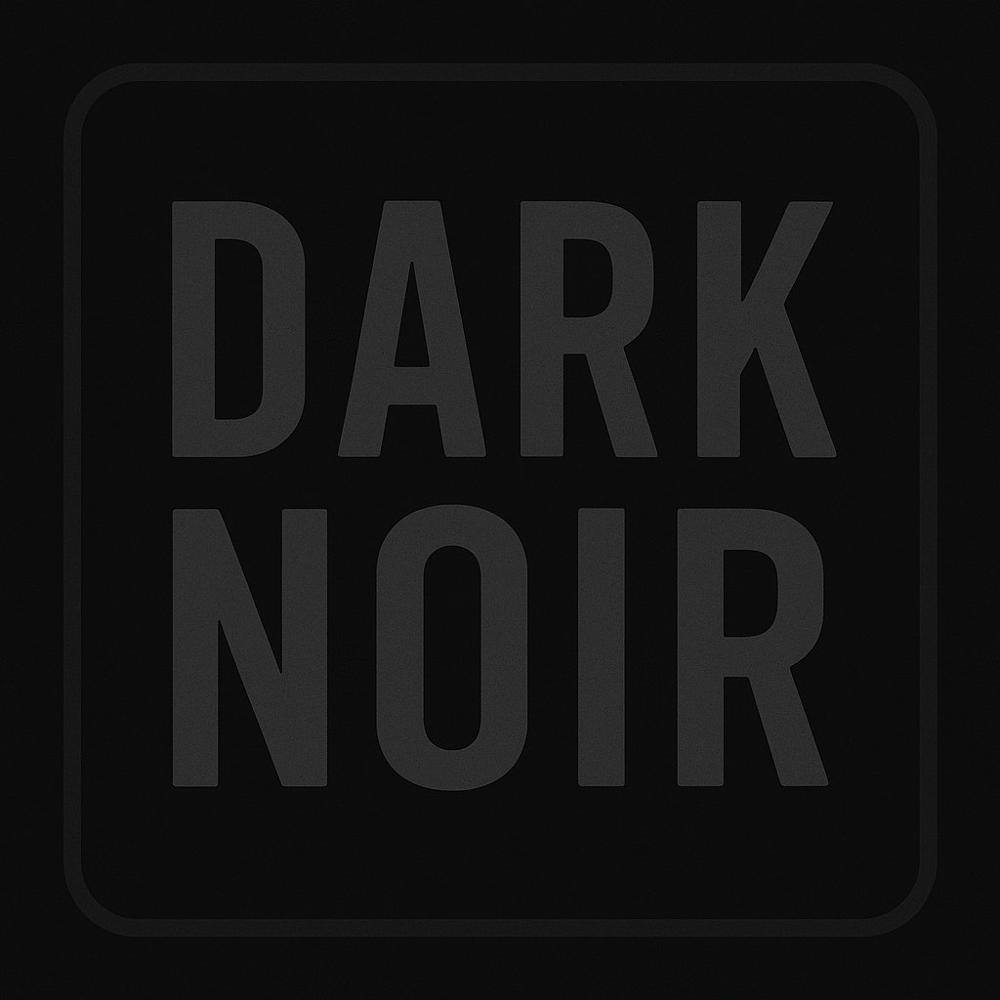
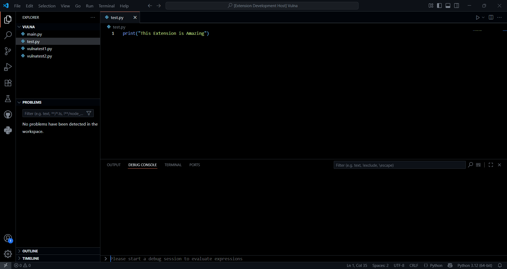

# Dark Noir Theme 

A low-contrast dark theme for VSCode with subtle, noir-inspired colors
A Visual Studio Code theme inspired by the CS50 Codespaces environment.

## Preview

## Installation
1. Open VS Code.
2. Press `Ctrl+P` (or `Cmd+P` on macOS), type: Preferences: color theme
3. Select the theme **Dark Noir** from the menu.

## Features
- Dark background with CS50-inspired colors.
- Syntax highlighting tuned for Python, C, and web languages.

## Contributing
Feel free to open issues or PRs to improve the theme.

---

**Enjoy!** 🎨

